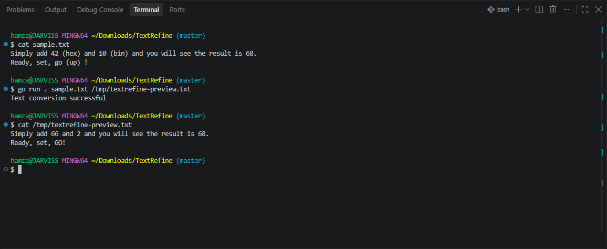

# TextRefine: CLI Text Processor

TextRefine is a Go command-line tool that reads a text file, applies inline editing instructions, and writes the formatted result to another file.

I built this project while learning to code, practicing file handling, regular expressions, string manipulation, and numeric conversion in Go. It uses only the Go standard library.



## Features

- Convert hexadecimal and binary numbers to decimal using `(hex)` and `(bin)`.
- Change word casing using `(up)`, `(low)`, and `(cap)`.
- Apply case changes to multiple preceding words with directives such as `(up, 2)`.
- Remove spaces before `.`, `,`, `!`, `?`, `:`, and `;`, and adjust comma spacing.
- Remove surrounding spaces inside single-quoted text.
- Change lowercase `a` to `an` before a vowel or `h`, following the assignment's rule.

## Requirements

- Go 1.21.4 or newer, as specified in `go.mod`.
- No third-party packages or additional installation steps.

## Usage

From the repository directory, create an input text file and run:

```sh
go run . sample.txt result.txt
```

The program expects two arguments: the input path and the output path. Quote paths containing spaces. The output file is created or overwritten, so choose a separate output path to retain your original input.

The included `sample.txt` and `result.txt` are empty placeholders. For example, put this in `sample.txt`:

```text
Simply add 42 (hex) and 10 (bin) and you will see the result is 68.
Ready, set, go (up) !
```

After running the command, `result.txt` will contain:

```text
Simply add 66 and 2 and you will see the result is 68.
Ready, set, GO!
```

On success, the program prints `Text conversion successful`. Incorrect argument counts and file read/write errors cause it to exit with status `1`.

## Editing directives

| Directive | Example input | Result |
| --- | --- | --- |
| `(hex)` | `1E (hex)` | `30` |
| `(bin)` | `101 (bin)` | `5` |
| `(up)` | `hello (up)` | `HELLO` |
| `(low)` | `HELLO (low)` | `hello` |
| `(cap)` | `hello (cap)` | `Hello` |
| `(up, N)` | `one two three (up, 2)` | `one TWO THREE` |
| `(low, N)` | `ONE TWO (low, 2)` | `one two` |
| `(cap, N)` | `harold wilson (cap, 2)` | `Harold Wilson` |

Directives are lowercase and should follow their target words with whitespace. Use valid numeric operands and positive word counts. Formatting is implemented through successive regular-expression replacements, so chained directives and complex punctuation combinations may behave differently from a full text parser. Case directives primarily target ASCII words, and numeric conversion uses signed 64-bit integers.

## Project structure

| File | Purpose |
| --- | --- |
| `main.go` | CLI entry point, file operations, and text-formatting functions |
| `go.mod` | Module name and Go version requirement |
| `sample.txt` | Placeholder for input text |
| `result.txt` | Placeholder for formatted output |

## Implementation

`main` validates the argument count, reads the input with `os.ReadFile`, calls `FormatText`, and writes the result with `os.WriteFile`. `FormatText` uses `regexp`, `strings`, and `strconv` to apply editing rules. The `Capitalize` helper handles capitalization of ASCII word parts.

This repository contains the original learning-project implementation and does not currently include automated tests.
